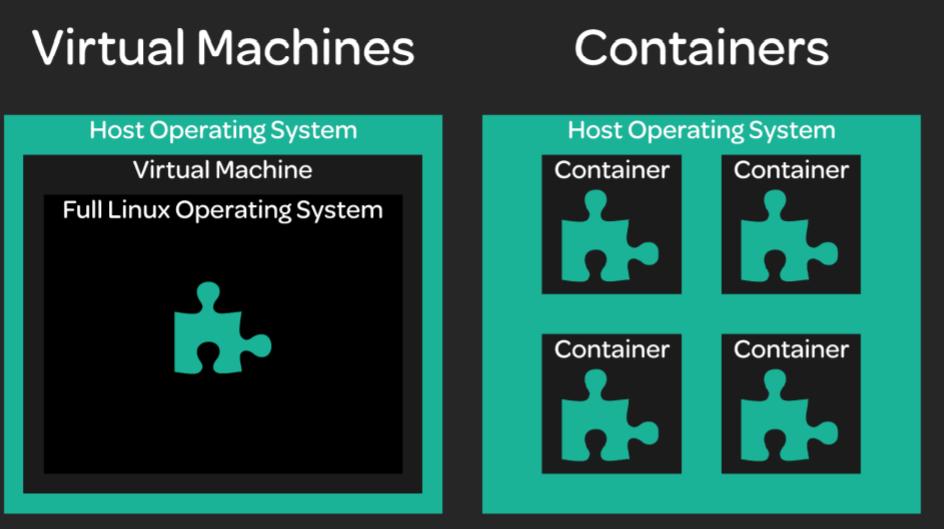
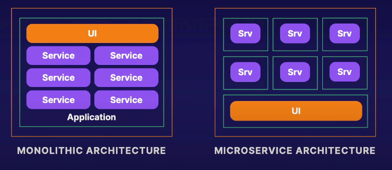

# Container

Containers are isolated execution environment that let us quickly and efficiently deploy exact copies of our desired environments. This is done by virtualizing at the operating system-level and isolating any libraries and applications within the container.

**Bare Metal**: No virtualization - the application or service is deployed directly onto the machine

### Container VS virtual machine

 

### Container Runtime

* docker (Most Popular)

* rkt

  Created by CoreOS, “designed with composability and security in mind.”

* containerd

  Emphasizes “simplicity, robustness, and portability"

### Container Use Case

* Solving Dev/Prod Parity
* Migrating Infrastructure
* Microservice-Based Architectures
* Elastic Architectures
* Self-Healing Architectures
* CI/CD pipeline

### Self Healing

Self-Healing Applications are applications that are able to automatically detect when something is broken and automatically take steps to correct the problem without the need for human involvement.

Since it is so quick and easy to start up new container instances, when something goes wrong with a container it can often be easily destroyed and replaced within a few seconds.

# Docker

## Concepts

* Docker hub: online official docker image repository	

Docker is primarily a container runtime.

```shell
# run docker 
docker run hello-world

```

## Install docker

Since we can bypass that step, we'll start with updating our machine.

```bash
sudo apt update
```

And then install any prerequisite packages.

```bash
sudo apt-get install apt-transport-https ca-certificates curl gnupg-agent software-properties-common
```

Note that many of these packages are already installed on our Playground server.

We can now add Docker's GPG key.

```bash
curl -fsSL https://download.docker.com/linux/ubuntu/gpg | sudo apt-key add -
```

And verify its configuration.

```bash
sudo apt-key fingerprint 0EBFCD88
```

To add the Docker repository, we now just need to run:

```bash
sudo add-apt-repository  "deb [arch=amd64] https://download.docker.com/linux/ubuntu $(lsb_release -cs) stable"
```

And update our server again.

```bash
sudo apt update
```

We can now install the necessary packages.

```bash
sudo apt install docker-ce docker-ce-cli containerd.io
```

To finish up, we want to add our `cloud_user` user to the `docker` group.

```bash
sudo usermod cloud_user -aG docker
```

Log out then log back in to refresh the Bash session before running any `docker` commands.

# Orchestration 

Kubernetes is Orchestration tool to manage container

### AWS EKS

Amazon Elastic Kubernetes Service (EKS) is a managed service that makes it easy for you to run Kubernetes on AWS without needing to install and operate your own Kubernetes control plane or worker nodes.

### Other Orchestration

* Marathon 

  Based on Apache Mesos, offers APIs for integrating with other tools.

* Docker Swarm

   Docker Swarm Docker’s native container orchestration solution

* Nomad

  Open source and built by HashiCorp, designed to be simple and lightweight.

# Scenario

Zero-Downtime Deployments

A zero-downtime deployment (with containers) goes like this: 

1. Spin up containers running the new code. 
2. When they are fully up, direct user traffic to the new containers. 
3. Remove the old containers running the old code. No downtime for users!

Containers are great at accomplishing things like: 

* Software Portability – Running software consistently on different machines. 
* Isolation – Keeping individual pieces of software separate from one another. 
* Scaling – Increasing or decreasing resources allocated to software as needed. 
* Automation – Automating processes to save time and money. 
* Efficient Resource Usage – Containers use resources efficiently, which saves money

# Microservice

### Monolith VS Microservices



Containers excel when it comes to managing a large number of small, independent workloads.

Containers and orchestration make it easier to manage and automate the process of deploying, scaling, and connecting lots of microservice instances. 

For example, I may have one microservice that needs additional resources. With containers, all I need to do is create more containers for that service to handle the load. With orchestration, that can even be done automatically and in real time!

# Cloud Transformation

Containers can help you move into the cloud. It is relatively easy to wrap existing software in containers. While containers may not be the answer for every type of existing software, they are a powerful tool.

Automated Scaling refers to automatically provisioning resources in response to real-time data metrics.

# CI/CD

Continuous Deployment is the practice of deploying new code automatically and frequently.

Instead of writing new code for months and doing a big deployment, continuous deployment means constantly doing many small deployments. Some companies even do multiple deployments a day!

Containers work very well in the context of continuous deployment. They make it easy to test code in an environment that is the same as production, because the code can be automatically tested inside the container itself.

An automation pipeline for continuous delivery can automatically build a container image with the new code, test it, then automatically ship that same container image production.

# Developer Visibility

With Containers, the container is the production environment. This means that anyone can spin up an environment that is exactly like production, even on their own laptop. Developers (and others) have the ability to test their code and see exactly how it will behave in production. 

The additional visibility offered by containers can help your organization develop and troubleshoot code much more efficiently!

# cloud and container

Why do Containers in the Cloud? 

Containers are just one way to run software in the cloud. 

Some of the benefits of using containers in the cloud are: 

• Regular Benefits of Containers You get all the normal benefits of containers in terms of portability, speed, and ease of automation. 

• Save Money Since containers are lightweight and have little overhead, they can help save on cloud costs. With cloud providers, you only pay for the resources you use. Use less resources, pay less 

• Cloud Platforms Offer Container Support out of the Box Most cloud platforms provide services built specifically for containers

# Next Steps

## Course on Linux Academy

| Course                    | Level    | Topic                     | Dependency                | Status   |
| ------------------------- | -------- | ------------------------- | ------------------------- | -------- |
| Container & Orchestration | Beginner | Container & Orchestration | No                        | Finished |
| Docker Quick Start        | Beginner | Docker                    | Container & Orchestration |          |
| Kubernetes Quick Start    | Beginner | Kubernetes                | Docker Quick Start        |          |

Containers 

•  LXC/LXD Deep Dive

 • CoreOS Essentials 

Docker 

• Docker Deep Dive 

• Docker Certified Associate Prep Course

Kubernetes 


• Certified Kubernetes Administrator (CKA)

• Kubernetes the Hard Way 

DevOps 

• DevOps Essentials 

• Implementing a Full CI/CD Pipeline

