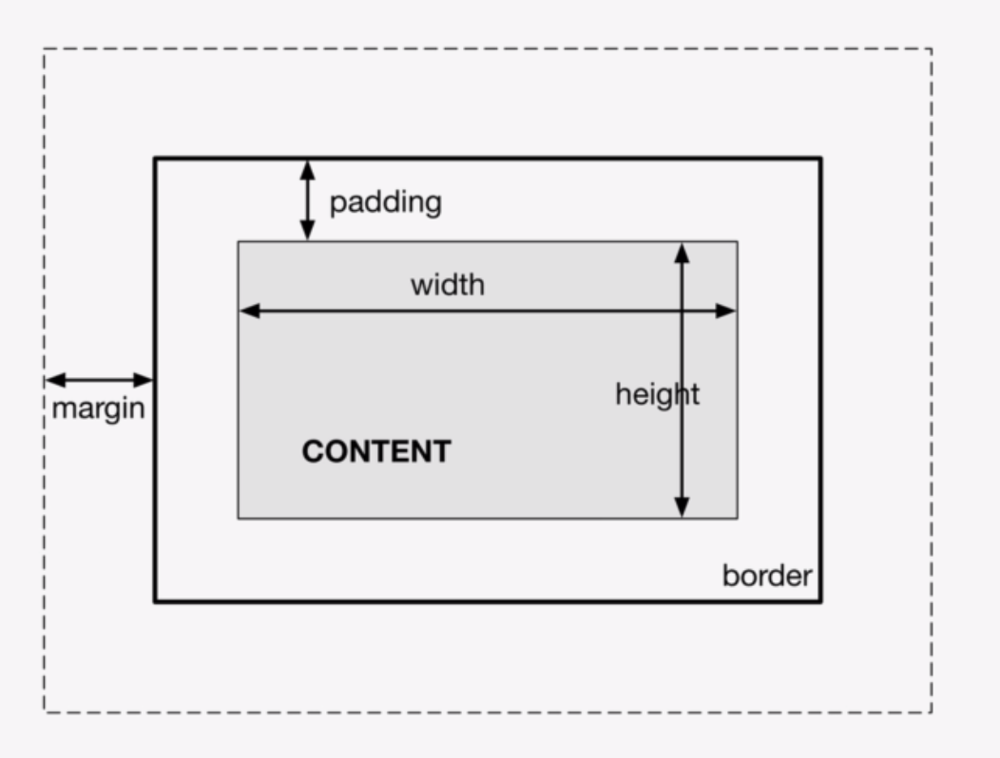

```html
<!DOCTYPE html>
<head>
    <link rel="stylesheet" type='text/css' href="style.css">
</head>
<body>
    <script src="script.js"></script>
</body>
</html>
```


### Form

when submit email address, in url @ will be change to %40, as @ is special symbol

```html
<!--faxiao -->
<form action="/submit" method="POST">
    First Name: <input type="text" name="firstname"><br>
    Email: <input type="email" name='email' required><br>
    Password: <input type="password" minlength=5 name="password">
    Birthday: <input type="date" name="birthday"><br>
    Gender: <input type="radio" name="gender" value="male">Male
    	    <input type="radio" name="gender" value="female">Female
    Pets: <input type="checkbox" namn="cats">Cat<br>
    <input type="checkbox" name="dogs">Dog<br>
    <!--Dropdown Manu -->
    <select name="car">
        <option value="volvo" >Volvo</option>
        <option value="audi">Audi</option>
    </select>
    <input type="submit" value="Register">
    <input type="reset" value="Reset">
</form>
```

# CSS

```html
<link href="style.css" rel="stylesheet" />
```

basic usage

```css
body {
    background-color: green;
    font-family: Arial;
    font-size: 20px;
    border: 5px solid #444
}
```

## Best Practice

### reset all the elements margin and padding

```css
* {
    margin: 0;
    padding: 0;
    box-sizing: border-box; /* no padding will calculate if the box width is defined */
}
```


## selector

```css
/* select from multiple tag */
input, button {
    
}

/* select from class */
.first {
    
}
/* select from id */
#id {
    
}

/* select h2 in div id */
#id h2 {
    
}
```

box model

